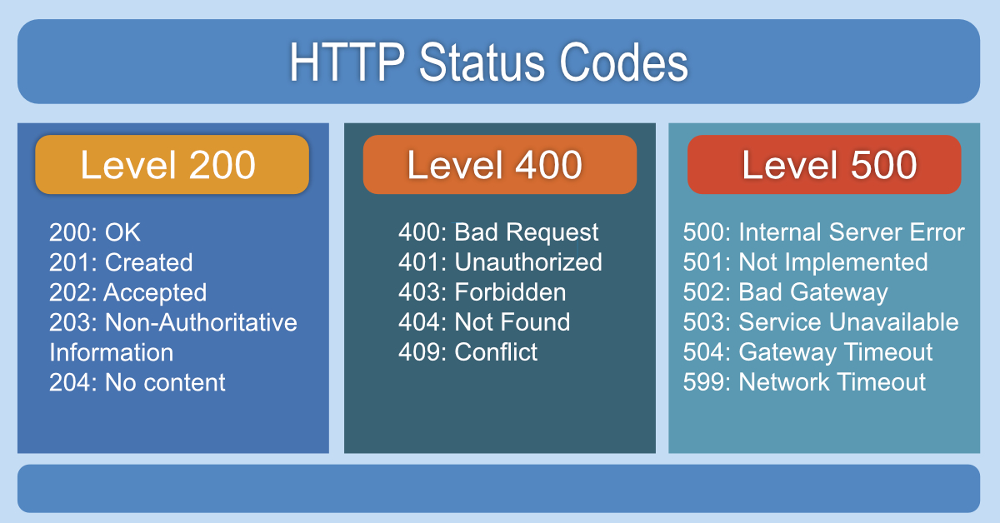
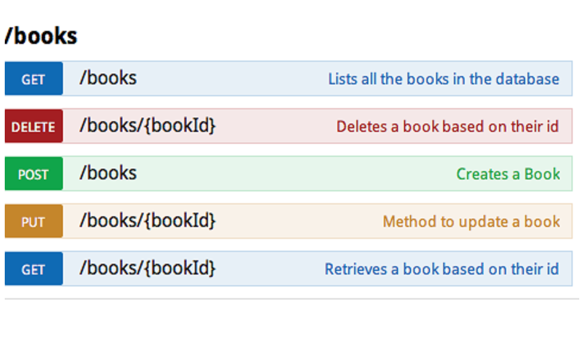

# api-js

Mostrar el *tiempo actual* en una ciudad.


# 1 añadimos vue

```
<head>
  ...
  ...
  <script src="https://unpkg.com/vue@next"></script>
</head>
```

```
<body>
  ...
  ...
  <script src="app.js"></script>
</body>
```

```
let app = Vue.createApp({

});
```

# 2 creamos app vue

```
let app = Vue.createApp({
});

app.mount("#app");
```

`[Vue warn]: Failed to mount app: mount target selector "#app" returned null.`

```
<body>
  <main id="app">
    ...
    ...
  </main>
  <script src="app.js"></script>
</body>
```

# 3 vue props

```
      <h2>{{city}}</h2>
      
      <h3>{{temperature}} ºC</h3>
```

```
  data() {
    return {
      city: 'BIO',
      image: 'images/rain.png',
      temperature: 11
    }
  },
```

# 3 obtener predicción real

```
  data() {
    return {
      city: undefined,
      image: undefined,
      temperature: undefined
    }
  },
  mounted() {
    this.city = 'BIO'
    this.image = 'images/rain.png'
    this.temperature = 11
  }
```

## Bilbao Weather

[https://my-json-server.typicode.com/jercilla/json-server-weather/cities/BIO](https://my-json-server.typicode.com/jercilla/json-server-weather/cities/BIO)

```
{
  "id": "BIO",
  "name": "Bilbao",
  "temperature": 11,
  "rain_probability": 0.9
}
```

```
  async mounted(){
    const url = 'https://xyz.com/jercilla/json-server-weather/cities/BIO'
    const response = await fetch(url)
    const data = await response.json()
    
    this.temperature = data.temperature
    this.city = data.id
    if (data.rain_probability > 0.5) {
      this.image = 'images/rain.png'
    } else {
      this.image = 'images/sunny.png'
    }
  }
```

## Diferencias de URL FRONT y BACK

`http://127.0.0.1:5500/index.html`

`https://my-json-server.typicode.com/jercilla/json-server-weather/cities/BIO`


# 4 gestión de errores


```
  async mounted(){
    const url = 'https://xyz.com/jercilla/json-server-weather/cities/NYC'
    this.isError = false
    const response = await fetch(url)
    
    if (response.ok) {
      ...
      ...
    } else {
      this.isError = true
    }
  }
```

```
  data() {
    return {
      ...
      isError: undefined      
    }
  },
```

```
  <main id="app">
    
    <div v-else class="weather-summary">
      ...
      ...
```

## Otro tipo de errores

```
  async mounted(){
    const url = 'https://xyz.com/jercilla/json-server-weather/cities/NYC'
    this.isError = false
    const response = await fetch(url)
                           .catch((e) => {
                             console.log('****ERROR', e)
                             this.isError = true
                           })    
    if (!this.isError && response?.ok) {
        ...
        ...
```



[HTTP response status codes](https://developer.mozilla.org/en-US/docs/Web/HTTP/Status
)


# 5 Loading...


```
  async mounted(){
    const url = 'https://xyz.com/jercilla/json-server-weather/cities/NYC'
    this.isError = false
    this.isLoading = true
    const response = await fetch(url)
                           .catch((e) => {
                             console.log('****ERROR', e)
                             this.isLoading = false
                             this.isError = true
                           })    
    if (!this.isError && response?.ok) {
      this.isLoading = false
      ...
      ...
```

```
  data() {
    return {
      ...
      isLoading: false   
    }
  },

```

```
  <main id="app">
    
      ...
```

# 6 Métodos de petición HTTP (aka 'http verbs')



https://developer.mozilla.org/es/docs/Web/HTTP/Methods
